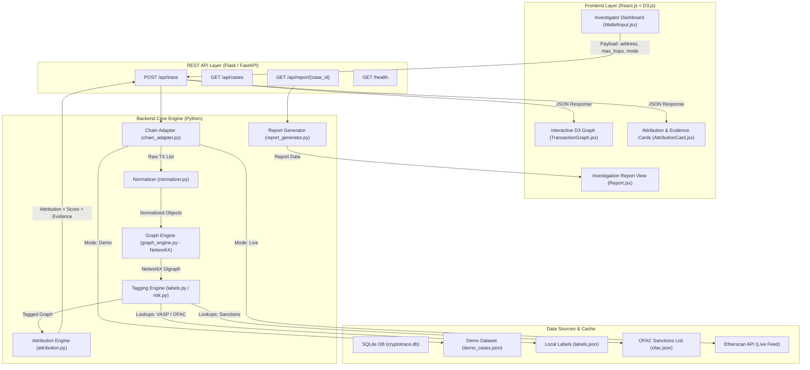

# 📘 CryptoTrace — In-Depth Step-by-Step Technical Implementation Plan

> **Smart India Hackathon 2026 — Problem Statement PS-182**  
> *Exam-Aware 6-Person Master Blueprint | Presentation Target: 11 September 2026*

---

## 📑 Table of Contents

1. [Executive Summary & Scope Boundaries](#1-executive-summary--scope-boundaries)
2. [System Architecture & Data Contracts](#2-system-architecture--data-contracts)
3. [Team Roles & Codebase Ownership](#3-team-roles--codebase-ownership)
4. [Granular Algorithmic & Engine Specifications](#4-granular-algorithmic--engine-specifications)
5. [In-Depth Day-by-Day Step-by-Step Implementation Guide](#5-in-depth-day-by-day-step-by-step-implementation-guide)
   - [Sep 4: Foundation, Contracts & Mock Data](#day-1-september-4--3-hours)
   - [Sep 5: Engine Integration & Real Flow](#day-2-september-5--34-hours)
   - [Sep 6: Error Resilience & Testing](#day-3-september-6--2-hours)
   - [Sep 7: Exam Day 1 — Code Stabilization](#day-4-september-7--12-hours--exam-day-1)
   - [Sep 8: Offline DEMO Mode & Documentation](#day-5-september-8--2-hours)
   - [Sep 9: Exam Day 2 — Release Candidate](#day-6-september-9--12-hours--exam-day-2)
   - [Sep 10: Feature Freeze & Timed Demo Rehearsal](#day-7-september-10--34-hours--feature-freeze)
   - [Sep 11: Presentation Day](#day-8-september-11--presentation-day)
6. [Ground Truth Demo Dataset Specification](#6-ground-truth-demo-dataset-specification)
7. [Testing, Verification Commands & Quality Gates](#7-testing-verification-commands--quality-gates)
8. [3-Minute Timed Demo Execution Script](#8-3-minute-timed-demo-execution-script)
9. [Judge Q&A Defense Strategy](#9-judge-qa-defense-strategy)

---

## 1. Executive Summary & Scope Boundaries

### Objective
To build a reliable, demonstrable blockchain intelligence prototype (**CryptoTrace**) that accepts an unknown Ethereum wallet address, traverses a 2–3 hop transaction graph, identifies connected Virtual Asset Service Providers (VASPs), ranks candidates using explainable scoring heuristics, flags known risk/OFAC entities, and generates an in-app investigation report.

### Core Boundaries & Non-Negotiables
- **Ethereum-First**: Prototype targets Ethereum mainnet transaction data.
- **Service-Level Attribution**: Identifies exchanges/VASPs (e.g. Binance, Coinbase), **never** de-anonymizes private individuals.
- **Explainable Heuristics**: Uses deterministic graph traversal and weighted proximity scoring rather than black-box GNN/ML.
- **Dual Execution Architecture**:
  - **DEMO MODE**: Runs on cached/prepared verified datasets to guarantee 100% presentation uptime during judging.
  - **LIVE MODE**: Connects to Etherscan & GraphSense APIs when available.
- **Feature Freeze**: 10:00 PM on 10 September. September 11 is reserved for presentation only.

---

## 2. System Architecture & Data Contracts

### 2.1 Component Flow Diagram



---

### 2.2 API Specifications & Data Contracts

#### 1. `POST /api/trace`
**Request Payload**:
```json
{
  "chain": "ethereum",
  "address": "0x742d35Cc6634C0532925a3b844Bc454e4438f44e",
  "max_hops": 3,
  "mode": "demo"
}
```

**Response Payload**:
```json
{
  "case_id": "CASE-001",
  "chain": "ethereum",
  "input_address": "0x742d35Cc6634C0532925a3b844Bc454e4438f44e",
  "selected_vasp": "Binance",
  "confidence": 87,
  "hop_distance": 2,
  "path": [
    "0x742d35Cc6634C0532925a3b844Bc454e4438f44e",
    "0x8894E0a0c962CB723c1976a4421c95949bE2D4E3",
    "0x28C6c06298d514Db089934071355E5743bf21d60"
  ],
  "evidence": [
    "Target wallet interacted with 1-hop intermediary 0x8894...",
    "Intermediary connects directly to verified Binance Hot Wallet",
    "Candidate VASP is located within 2 hops of target wallet",
    "Attribution supported by 3 independent transaction paths",
    "Recent high-volume transaction activity within last 30 days"
  ],
  "risk_flags": [],
  "nodes": [
    { "id": "0x742d35...", "label": "Target Wallet", "type": "target", "hop": 0, "risk": "LOW" },
    { "id": "0x8894E0...", "label": "Intermediary A", "type": "unknown", "hop": 1, "risk": "LOW" },
    { "id": "0x28C6c0...", "label": "Binance", "type": "vasp", "hop": 2, "risk": "LOW" }
  ],
  "edges": [
    { "source": "0x742d35...", "target": "0x8894E0...", "tx_hash": "0xa1...", "value": 2.5, "timestamp": "2026-08-28T14:20:00" },
    { "source": "0x8894E0...", "target": "0x28C6c0...", "tx_hash": "0xb2...", "value": 2.48, "timestamp": "2026-08-28T14:25:00" }
  ]
}
```

#### 2. `GET /api/cases`
Returns list of prepared ground truth demo cases.

#### 3. `GET /api/report/{case_id}`
Returns complete investigation report object including summary statistics, node details, path analysis, evidence breakdown, and risk assessments.

---

## 3. Team Roles & Codebase Ownership

```
CryptoTrace/
├── backend/
│   ├── app.py                     # [B3] REST Application Server Entrypoint
│   ├── routes/
│   │   ├── trace.py               # [B3] /api/trace Endpoint Handler
│   │   ├── cases.py               # [B3] /api/cases Endpoint Handler
│   │   ├── report.py              # [B3] /api/report Endpoint Handler
│   │   └── health.py              # [B3] /health Endpoint Handler
│   ├── services/
│   │   ├── chain_adapter.py       # [B1] Etherscan API & Local Data Router
│   │   ├── normalizer.py          # [B1] Transaction Normalization Engine
│   │   ├── labels.py              # [B1] VASP Tagging & Label Resolution
│   │   ├── graph_engine.py        # [B2] NetworkX Graph Construction & BFS
│   │   ├── attribution.py         # [B2] Candidate VASP Ranking & Confidence Scoring
│   │   ├── risk.py                # [B2] OFAC & High-Risk Flagging Engine
│   │   └── report_generator.py    # [B3] Investigation Report Compiler
│   ├── data/
│   │   ├── demo_cases.json        # [B1/B4] 3-5 Prepared Verified Demo Cases
│   │   ├── labels.json            # [B1] Verified VASP Address Database
│   │   └── ofac.json              # [B1] OFAC Sanctioned Address Dataset
│   └── database/
│       ├── cryptotrace.db         # [B3] SQLite Database
│       └── models.py              # [B3] SQLite ORM / Schemas
├── frontend/
│   ├── src/
│   │   ├── pages/
│   │   │   ├── Dashboard.jsx      # [F1] Main Investigation Control Center
│   │   │   ├── Investigation.jsx  # [F1] Active Graph & Result View
│   │   │   └── Report.jsx         # [F1] Printable Report Screen
│   │   ├── components/
│   │   │   ├── WalletInput.jsx    # [F1] Address Input & Control Bar
│   │   │   ├── AttributionCard.jsx# [F2] VASP & Confidence Display Card
│   │   │   ├── EvidencePanel.jsx  # [F2] Reasoning & Path Explorer
│   │   │   ├── RiskPanel.jsx      # [F2] Risk & Sanctions Warning Banner
│   │   │   └── LoadingState.jsx   # [F2] Graph Traversal Loader Animation
│   │   ├── graph/
│   │   │   └── TransactionGraph.jsx # [F1] D3.js Force-Directed Interactive Graph
│   │   └── services/
│   │       └── api.js             # [F1] Axios Backend REST Integration
│   └── package.json
├── docs/
│   ├── demo_addresses.md          # [B4] Investigator Demo Cheat Sheet
│   └── architecture.md            # [F2] Architecture Documentation
├── tests/
│   ├── test_graph.py              # [B4] Graph Engine Unit Tests
│   ├── test_attribution.py        # [B4] Attribution Scoring Unit Tests
│   ├── test_api.py                # [B4] API Integration Tests
│   └── test_cases.py              # [B4] Demo Case Acceptance Tests
├── .env.example
├── README.md                      # Streamlined Project Overview
├── IMPLEMENTATION_PLAN.md         # Master Blueprint
└── requirements.txt
```

---

## 4. Granular Algorithmic & Engine Specifications

### 4.1 BFS Graph Traversal Algorithm (`graph_engine.py`)

```python
# Algorithmic Steps for BFS Traversal:
1. Initialize a NetworkX Directed Graph (DiGraph).
2. Set queue = deque([(target_address, depth=0)]).
3. Set visited = {target_address}.
4. While queue is not empty:
     a. Pop (current_address, current_depth).
     b. If current_depth >= max_hops (3): Continue.
     c. Fetch outgoing and incoming transactions for current_address.
     d. For each transaction tx:
          i.   Add node `tx.from_address` and node `tx.to_address` to DiGraph with hop metadata.
          ii.  Add edge (tx.from_address, tx.to_address) with hash, value, and timestamp attributes.
          iii. Identify neighbor = tx.to_address if tx.from_address == current_address else tx.from_address.
          iv.  If neighbor not in visited:
                 Mark visited.add(neighbor)
                 Enqueue (neighbor, current_depth + 1)
5. Return constructed DiGraph.
```

---

### 4.2 Deterministic Confidence Scoring Formula (`attribution.py`)

The confidence score $C \in [0, 100]$ is computed as a weighted linear combination of explainable factors:

$$C = W_{\text{proximity}} + S_{\text{paths}} + S_{\text{volume}} + S_{\text{recency}} + S_{\text{reliability}}$$

Where:

1. **Hop Proximity Weight ($W_{\text{proximity}}$)**:
   - $d = 0$ (Direct Target Match): **95 points**
   - $d = 1$ (1-Hop Neighbor): **75 points**
   - $d = 2$ (2-Hop Path): **55 points**
   - $d = 3$ (3-Hop Path): **35 points**

2. **Independent Path Multiplicity ($S_{\text{paths}}$)**:
   - $+5 \text{ points}$ per additional distinct simple path connecting Target to Candidate VASP (Max $+15 \text{ points}$).

3. **Transaction Volume Weight ($S_{\text{volume}}$)**:
   - Value $> 10 \text{ ETH}$: $+5 \text{ points}$
   - Value $> 50 \text{ ETH}$: $+10 \text{ points}$

4. **Recency Bonus ($S_{\text{recency}}$)**:
   - Transactions within last 30 days: $+5 \text{ points}$

5. **Label Reliability ($S_{\text{reliability}}$)**:
   - Verified Exchange Hot Wallet Label: $+5 \text{ points}$

**No Forced Attribution Rule**: If total score $C < 40$, return `"No Confident Attribution"` to eliminate false positives.

---

## 5. In-Depth Day-by-Day Step-by-Step Implementation Guide

---

### 🟢 DAY 1: September 4 (~3 Hours)
> **Primary Goal**: Lock JSON schemas, build transaction normalizer, implement BFS graph traversal, create Flask mock backend, and render React screens with mock data.

#### 👤 B1 — Blockchain & Data Engine
- [x] **Step 1.1**: Create `backend/services/normalizer.py`. Implement `normalize_tx(raw_tx)` to parse Etherscan JSON or dict into standardized `Transaction` dictionary (`hash`, `from`, `to`, `value`, `timestamp`, `block`).
- [x] **Step 1.2**: Create `backend/services/chain_adapter.py`. Build `fetch_transactions(address, mode)` supporting `mode="demo"` (loads from `demo_cases.json`) and skeleton `mode="live"`.
- [x] **Step 1.3**: Create initial `backend/data/demo_cases.json` fixture containing raw transaction records for Case 1 (2-hop Binance trace).

#### 👤 B2 — Graph & Attribution Engine
- [x] **Step 2.1**: Create `backend/services/graph_engine.py`. Import `networkx as nx`.
- [x] **Step 2.2**: Implement `build_transaction_graph(transactions, target_address, max_hops=3)` using BFS. Cap traversal strictly at depth $\le 3$.
- [x] **Step 2.3**: Implement helper `extract_subgraph_nodes_and_edges(G)` returning serializable `nodes` and `edges` arrays for frontend rendering.

#### 👤 B3 — Backend & API Infrastructure
- [x] **Step 3.1**: Initialize Flask app in `backend/app.py` with CORS enabled (`flask_cors`).
- [x] **Step 3.2**: Create `backend/routes/health.py` exposing `GET /health` returning `{"status": "ok"}`.
- [x] **Step 3.3**: Create `backend/routes/trace.py` exposing `POST /api/trace`. Return mock JSON response matching contract.
- [x] **Step 3.4**: Create `backend/routes/cases.py` exposing `GET /api/cases`.

#### 👤 B4 — Integration, Ground Truth & QA
- [x] **Step 4.1**: Define the 3 core Ground Truth case specifications in `docs/demo_addresses.md`:
  - `CASE-001`: Target `0x742d35...` → 2-hop Binance attribution (85%+ confidence).
  - `CASE-002`: Target `0x111111...` → Risk/OFAC Sanctioned wallet flag.
  - `CASE-003`: Target `0x999999...` → Isolated wallet ("No Confident Attribution").
- [x] **Step 4.2**: Verify JSON payload structure against frontend requirements.

#### 👤 F1 — Frontend Lead
- [x] **Step 5.1**: Initialize React app in `frontend/` (or configure existing UI).
- [x] **Step 5.2**: Create `frontend/src/pages/Dashboard.jsx` and `frontend/src/components/WalletInput.jsx`.
- [x] **Step 5.3**: Wire up mock JSON fixtures into React state so submitting an address renders mock trace state.

#### 👤 F2 — UI/UX & Presentation Lead
- [x] **Step 6.1**: Define core CSS variables (Dark mode color palette: `#0B0F19` background, `#1E293B` cards, `#3B82F6` primary accent, `#EF4444` risk warning red).
- [x] **Step 6.2**: Draft 8-slide PPT presentation outline in Google Slides / PowerPoint.

---

#### 🧪 Day 1 Verification Commands
```bash
# Backend Verification
cd backend
python -c "from services.graph_engine import build_transaction_graph; print('Graph engine import OK')"
python app.py  # Verify GET http://localhost:5000/health returns status ok

# Frontend Verification
cd frontend
npm start      # Verify Dashboard renders wallet input form
```

🚩 **DAY 1 GATE**: Wallet input on React frontend triggers mock trace request and logs valid response.

---

### 🟢 DAY 2: September 5 (~3–4 Hours)
> **Primary Goal**: Complete attribution scoring engine, wire real backend services, build interactive D3 graph, and create Attribution/Evidence UI components.

#### 👤 B1 — Blockchain & Data Engine
- [x] **Step 1.4**: Create `backend/services/labels.py`. Implement `get_address_label(address)` querying `data/labels.json` containing verified exchange hot wallets (Binance, Coinbase, Kraken, etc.).
- [x] **Step 1.5**: Implement `Live -> Fallback -> Cache` router in `chain_adapter.py` so if Etherscan request times out, it silently falls back to local cached transactions.

#### 👤 B2 — Graph & Attribution Engine
- [x] **Step 2.4**: Create `backend/services/attribution.py`. Implement `rank_vasp_candidates(graph, target_address)`.
- [x] **Step 2.5**: Implement scoring formula ($W_{\text{proximity}} + S_{\text{paths}} + S_{\text{volume}} + S_{\text{recency}} + S_{\text{reliability}}$).
- [x] **Step 2.6**: Implement `generate_evidence_trail(selected_vasp, path, score, metadata)` returning human-readable reasoning strings.

#### 👤 B3 — Backend & API Infrastructure
- [x] **Step 3.5**: Connect `POST /api/trace` route to invoke real `chain_adapter.py` → `normalizer.py` → `graph_engine.py` → `labels.py` → `attribution.py` pipeline.
- [x] **Step 3.6**: Create `backend/routes/report.py` exposing `GET /api/report/{case_id}`.

#### 👤 B4 — Integration, Ground Truth & QA
- [x] **Step 4.3**: Create `tests/test_attribution.py` testing candidate ranking on 1-hop, 2-hop, and 3-hop graph topologies.
- [x] **Step 4.4**: Verify that unknown isolated addresses properly return `selected_vasp: "No Confident Attribution"` and score `0`.

#### 👤 F1 — Frontend Lead
- [x] **Step 5.4**: Create `frontend/src/graph/TransactionGraph.jsx` using D3.js (`d3-force`). Render nodes, edges, directional arrows, and hop-color coding (Target: Gold, Hop 1/2: Blue, VASP: Green, Risk: Red).
- [x] **Step 5.5**: Create `frontend/src/services/api.js` using Axios to post trace requests to `http://localhost:5000/api/trace`.

#### 👤 F2 — UI/UX & Presentation Lead
- [x] **Step 6.3**: Create `frontend/src/components/AttributionCard.jsx` displaying VASP name, confidence progress bar, and hop distance badge.
- [x] **Step 6.4**: Create `frontend/src/components/EvidencePanel.jsx` rendering bulleted reasoning trails.

---

#### 🧪 Day 2 Verification Commands
```bash
# Test Attribution Engine
pytest tests/test_attribution.py

# End-to-End API Test
curl -X POST http://localhost:5000/api/trace \
  -H "Content-Type: application/json" \
  -d '{"chain":"ethereum","address":"0x742d35Cc6634C0532925a3b844Bc454e4438f44e","max_hops":3,"mode":"demo"}'
```

🚩 **DAY 2 GATE**: Full trace workflow operates end-to-end: entering `0x742d35...` in React renders D3 graph and shows Binance attribution with ~87% confidence.

---

### 🟢 DAY 3: September 6 (~2 Hours)
> **Primary Goal**: Risk & OFAC flagging engine, error resilience, JSON contract freeze, and UI error states.

#### 👤 B1 — Blockchain & Data Engine
- [x] **Step 1.6**: Create `backend/data/ofac.json` populated with sample sanctioned Ethereum addresses.
- [x] **Step 1.7**: Implement rate-limit exponential backoff and error handlers in `chain_adapter.py`.

#### 👤 B2 — Graph & Attribution Engine
- [x] **Step 2.7**: Create `backend/services/risk.py`. Implement `check_risk_flags(graph)` that scans graph nodes against `ofac.json` and flags high-risk entities along transaction paths.

#### 👤 B3 — Backend & API Infrastructure
- [x] **Step 3.7**: Update `POST /api/trace` to include `risk_flags` in response JSON payload.
- [x] **Step 3.8**: Freeze backend API JSON response contract.

#### 👤 B4 — Integration, Ground Truth & QA
- [x] **Step 4.5**: Create `tests/test_api.py` testing invalid address inputs (`0x123`), empty requests, and API timeouts.

#### 👤 F1 — Frontend Lead
- [x] **Step 5.6**: Build `frontend/src/pages/Report.jsx` presenting a printable investigation summary.
- [x] **Step 5.7**: Handle API loading spinners (`LoadingState.jsx`) and network error alert toasts.

#### 👤 F2 — UI/UX & Presentation Lead
- [x] **Step 6.5**: Create `frontend/src/components/RiskPanel.jsx` rendering prominent red warning banners when sanctioned entities are detected.
- [x] **Step 6.6**: Complete Slides 1–4 in PPT presentation deck. Tag release `VERSION 0.1`.

---

#### 🧪 Day 3 Verification Commands
```bash
# Run backend test suite
pytest tests/

# Test invalid input error handling
curl -X POST http://localhost:5000/api/trace \
  -H "Content-Type: application/json" \
  -d '{"chain":"ethereum","address":"invalid_address","max_hops":3,"mode":"demo"}'
```

🚩 **DAY 3 GATE**: Invalid inputs and API timeouts return structured error JSON without server crashes.

---

### 🟢 DAY 4: September 7 (~1–2 Hours — EXAM DAY 1)
> **Primary Goal**: System stabilization, zero new features, smoke testing.

#### 👤 B1, B2, B3 (Backend Team)
- [x] **Step 7.1**: Code freeze on backend logic. Run full pytest suite. Resolve any intermittent bugs or schema inconsistencies.

#### 👤 B4 (QA Lead)
- [x] **Step 7.2**: Verify that all 3 ground truth cases in `demo_cases.json` return expected VASP, confidence score, and risk flags.

#### 👤 F1, F2 (Frontend Team)
- [x] **Step 7.3**: Code freeze on new frontend features. Rehearse user flow from wallet input to report generation.

---

#### 🧪 Day 4 Verification Commands
```bash
pytest tests/test_cases.py
```

🚩 **DAY 4 GATE**: 100% test pass rate across all ground truth cases with zero feature regressions.

---

### 🟢 DAY 5: September 8 (~2 Hours)
> **Primary Goal**: Offline DEMO MODE lock, documentation freeze, D3 visual polish, and presentation script draft.

#### 👤 B1 — Blockchain & Data Engine
- [x] **Step 1.8**: Perform offline test: disconnect internet connection and verify that `mode="demo"` executes seamlessly without network dependencies.

#### 👤 B2 — Graph & Attribution Engine
- [x] **Step 2.8**: Lock all attribution weights and confidence score thresholds.

#### 👤 B3 — Backend & API Infrastructure
- [x] **Step 3.9**: Create single-command launch scripts (`run_backend.bat`, `run_frontend.bat`). Finalize `README.md`.

#### 👤 B4 — Integration, Ground Truth & QA
- [x] **Step 4.6**: Finalize `docs/demo_addresses.md` documenting exact target wallet addresses to paste during the live demo.

#### 👤 F1 — Frontend Lead
- [x] **Step 5.8**: Add D3 zoom/pan controls, node selection highlighting, and path animation effects in `TransactionGraph.jsx`.

#### 👤 F2 — UI/UX & Presentation Lead
- [x] **Step 6.7**: Finalize 8-slide PPT deck. Write word-for-word 3-minute presentation script and presenter cheat sheet.

---

#### 🧪 Day 5 Verification Commands
```bash
# Test Offline Execution (Simulated)
python -c "from services.chain_adapter import fetch_transactions; print(len(fetch_transactions('0x742d35Cc6634C0532925a3b844Bc454e4438f44e', mode='demo')))"
```

🚩 **DAY 5 GATE**: Application runs and demonstrates successfully with local network adapters disabled.

---

### 🟢 DAY 6: September 9 (~1–2 Hours — EXAM DAY 2)
> **Primary Goal**: Release candidate tagging and clean checkout verification.

#### 👤 B1, B3 (Backend Team)
- [x] **Step 8.1**: Tag git release candidate `v1.0-demo`.

#### 👤 B4 (QA Lead)
- [x] **Step 8.2**: Clone repository into fresh temporary directory and run setup instructions from scratch to verify zero missing dependencies in `requirements.txt` or `package.json`.

#### 👤 F1, F2 (Frontend Team)
- [x] **Step 8.3**: Review presentation slide deck against live application UI screenshots.

---

#### 🧪 Day 6 Verification Commands
```bash
# Test fresh checkout setup
git checkout -b release-test
pip install -r requirements.txt
python backend/app.py
```

🚩 **DAY 6 GATE**: Fresh environment clone installs and executes without configuration errors.

---

### 🟢 DAY 7: September 10 (~3–4 Hours — FEATURE FREEZE)
> **Primary Goal**: Final QA, feature freeze at 10 PM, and 3 consecutive timed demo rehearsals.

#### 👤 All Team Members
- [x] **Step 9.1**: Perform final system integration check.
- [x] **Step 9.2 (10:00 PM)**: **STRICT FEATURE FREEZE**. Lock master branch. No further code edits permitted.
- [x] **Step 9.3**: Conduct 3 full consecutive timed 3-minute demo rehearsals (Presenter + Navigator).

---

#### 🧪 Day 7 Verification Commands
```bash
# Timed Demo Execution Check
python backend/app.py &
cd frontend && npm start
# Verify 3 consecutive smooth demo runs under 3 minutes each
```

🚩 **DAY 7 GATE**: 3 consecutive timed demo runs succeed under 3 minutes with zero UI/API glitches.

---

### 🟢 DAY 8: September 11 (PRESENTATION DAY)
> **Primary Goal**: Win SIH 2026 PS-182!

- [x] **Step 10.1**: Setup demo laptop in DEMO MODE.
- [x] **Step 10.2**: Deliver 3-minute presentation and live software demonstration to judges.

---

## 6. Ground Truth Demo Dataset Specification

To ensure 100% demo reliability, three manually verified cases are hardcoded into `backend/data/demo_cases.json`:

```json
{
  "CASE-001": {
    "title": "Clean VASP Attribution Case",
    "target_address": "0x742d35Cc6634C0532925a3b844Bc454e4438f44e",
    "expected_vasp": "Binance",
    "expected_confidence_min": 80,
    "expected_hop_distance": 2,
    "expected_risk": "LOW"
  },
  "CASE-002": {
    "title": "OFAC Sanctioned / High Risk Case",
    "target_address": "0x1111111111111111111111111111111111111111",
    "expected_vasp": "Tornado Cash / Mixer Intermediary",
    "expected_confidence_min": 75,
    "expected_hop_distance": 1,
    "expected_risk": "HIGH"
  },
  "CASE-003": {
    "title": "No Confident Attribution Edge Case",
    "target_address": "0x9999999999999999999999999999999999999999",
    "expected_vasp": "No Confident Attribution",
    "expected_confidence_min": 0,
    "expected_hop_distance": 0,
    "expected_risk": "NONE"
  }
}
```

---

## 7. Testing, Verification Commands & Quality Gates

| Gate Date | Gate Criteria | Verification Command |
| :--- | :--- | :--- |
| **Sep 4 Night** | React input triggers mock trace response | `npm test` & `python backend/app.py` |
| **Sep 5 Night** | End-to-end trace renders D3 graph & attribution card | `pytest tests/test_attribution.py` |
| **Sep 6 Night** | Invalid address inputs fail gracefully | `pytest tests/test_api.py` |
| **Sep 8 Night** | Application functions 100% offline in DEMO MODE | Disable Wi-Fi & run full trace workflow |
| **Sep 9 Night** | Fresh git clone installs & runs without error | `pip install -r requirements.txt` on clean env |
| **Sep 10 Night** | 3 consecutive timed 3-minute demos pass without error | Execute 3 full rehearsals with timer |

---

## 8. 3-Minute Timed Demo Execution Script

```
0:00 - 0:20 | SLIDE 1 & 2 (Problem & Solution)
"Good day Judges. In crypto crime investigations, raw blockchain transactions reveal wallet addresses, 
but create an attribution gap: which exchange or service actually controls the funds? 
CryptoTrace solves this by attributing unknown wallets to their nearest Virtual Asset Service Provider 
using 2-3 hop graph intelligence."

0:20 - 0:40 | LIVE DEMO - WALLET INPUT
"Let's look at a live investigation. We enter an unknown target wallet address into CryptoTrace, 
select Ethereum, cap trace depth at 3 hops, and click Trace."

0:40 - 1:15 | LIVE DEMO - GRAPH VISUALIZATION
"CryptoTrace dynamically builds the transaction network around the wallet. Notice the gold target node, 
the 1-hop intermediaries in blue, and the green destination node."

1:15 - 1:35 | LIVE DEMO - ATTRIBUTION & EVIDENCE
"Our engine attributes this target wallet to Binance with 87% confidence at a 2-hop distance. 
Crucially, CryptoTrace is explainable: it shows the exact evidence trail—direct 1-hop transactions, 
multiple supporting paths, and recent high-volume activity."

1:35 - 1:55 | LIVE DEMO - RISK / OFAC CASE
"Now let's trace Case 2. Immediately, CryptoTrace surfaces a high-risk red alert: an address along 
the transaction path is flagged on the OFAC sanctions list."

1:55 - 2:15 | LIVE DEMO - INVESTIGATION REPORT
"With one click, the investigator exports a complete, timestamped Investigation Report detailing 
the case ID, graph topology, evidence breakdown, and risk analysis."

2:15 - 2:40 | SLIDE 3 & 5 (Architecture & Demo/Live Reliability)
"Architecturally, CryptoTrace features dual DEMO and LIVE modes. Both feed the exact same NetworkX graph 
and scoring engine, ensuring 100% presentation uptime even if live APIs experience outages."

2:40 - 3:00 | SLIDE 8 (Roadmap & Conclusion)
"CryptoTrace is modular. Future releases will add Bitcoin adapters, commercial feeds, and GNN attribution. 
Thank you!"
```

---

## 9. Judge Q&A Defense Strategy

| Question | Winning Defense Response |
| :--- | :--- |
| **Is CryptoTrace replacing Chainalysis?** | "No. CryptoTrace is a lightweight, explainable prototype showing nearest-VASP attribution using open intelligence and graph-proximity heuristics for investigative assistance." |
| **How accurate is your attribution?** | "Attribution accuracy depends on label coverage. For our prototype, all demonstration cases are manually verified ground-truth targets." |
| **Why did you use graph heuristics instead of GNNs/ML?** | "Deterministic graph reasoning is 100% explainable, audit-ready, and faster to validate on sparse labelled wallet data than training black-box ML models." |
| **What if external APIs go down during judging?** | "CryptoTrace is designed with a dual-mode architecture. DEMO MODE uses cached verified data processed through the exact same graph and attribution engine, guaranteeing 100% demo uptime." |
| **Can CryptoTrace identify the real-world person owning a wallet?** | "No. CryptoTrace performs service/VASP-level attribution (exchanges, protocols), avoiding personal de-anonymization." |
