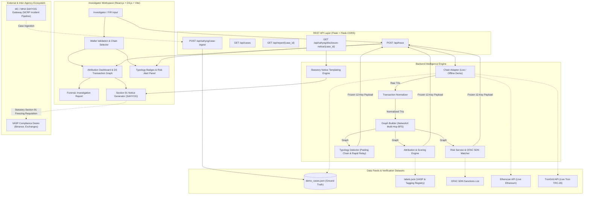

# 🔍 CryptoTrace

### Automated Attribution of Unknown Cryptocurrency Wallets to Nearest Virtual Asset Service Providers (VASPs)

> **Smart India Hackathon 2026 — Problem Statement PS-182**

CryptoTrace is a specialized blockchain intelligence and law-enforcement investigation platform designed for AML compliance officers, cybercrime police units, and intelligence cells to attribute unknown cryptocurrency wallets to their **nearest likely Virtual Asset Service Provider (VASP)** using multi-hop transaction graph analysis, algorithmic laundering typology detection, explainable scoring heuristics, and automated statutory requisition generator for the **I4C SAHYOG** gateway.

---

## 📌 Problem & Objective

Raw blockchain transactions reveal wallet addresses and movement of funds, but rarely indicate which exchange or service controls an address. During active cyber fraud investigations, investigating officers face two critical bottlenecks:
1. **Attribution Gap**: Identifying where stolen or laundered cryptocurrency was deposited within multi-hop laundering chains.
2. **Actionability Gap**: Speedily serving legally binding freeze orders to exchange compliance nodal desks before funds are withdrawn to fiat.

- **Primary Goal**: Accept an unknown wallet address (Ethereum / Tron TRC-20), traverse 2–3 hops of transaction history, identify connected labelled VASP entities, detect laundering typologies (e.g., Peeling Chains, Rapid Relays), rank candidate VASPs with an explainable confidence score, and generate court-admissible forensic reports and Section 91 statutory freeze notices.
- **Service-Level Focus**: CryptoTrace performs **service/VASP-level attribution** (e.g., Binance, Coinbase, OFAC SDN entities). It does **not** attempt personal de-anonymization or claim speculative off-chain identities.

---

## ⚡ Core Features

- **Multi-Hop Traversal (2–3 Hops)**: BFS graph traversal starting from an unknown target wallet across layered transaction hops.
- **Explainable Attribution Engine**: Ranks candidate VASPs using graph proximity, path multiplicity, transaction recency, and label reliability.
- **Modus Operandi & Typology Detection**:
  - ⚡ **Peeling Chain**: Flags automated peeling behavior where small amounts are repeatedly stripped while bulk funds are relayed forward.
  - ⏱️ **Rapid Pass-Through**: Detects fast relay hops (< 15-minute inter-hop intervals) indicative of automated laundering bots.
  - 🌀 **Mixer Obfuscation**: Flags proximity to mixers, tumblers, and high-risk privacy protocols.
- **I4C SAHYOG Cybercrime Gateway Readiness**:
  - `POST /api/sahyog/case-ingest`: Ingests cyber fraud complaints directly matching National Cybercrime Reporting Portal (NCRP) schema.
  - `GET /api/sahyog/disclosure-notice/<case_id>`: Produces official statutory requisition directives for immediate asset preservation.
- **Section 91 / 102 CrPC & BNSS Notice Generator**: Pre-formats lawful disclosure and freezing orders under **Sections 91 & 102 of the Code of Criminal Procedure, 1973** (and **Sections 94 & 106 of Bharatiya Nagarik Suraksha Sanhita, 2023**) to serve to VASP compliance desks.
- **Dual Execution Modes**:
  - 🛠 **DEMO MODE**: Uses verified, cached local datasets ensuring 100% offline reliability during live evaluations.
  - 🌐 **LIVE MODE**: Queries live Etherscan and open intelligence APIs.
- **Risk & OFAC Flagging**: Instant visual alert banner for currently designated OFAC SDN entities (e.g., Lazarus Group / Ronin Bridge exploiter).
- **Interactive D3 Transaction Graph**: Dynamic visual exploration of nodes, edges, hop levels, and highlighted attribution paths.
- **Investigation Report Generation**: Exportable case summary detailing VASP candidates, confidence level, evidence trail, risk breakdown, and printable legal report.

---

## 🏗 System Architecture



---

## 🔍 Attribution Methodology & Scoring

CryptoTrace uses deterministic, explainable graph heuristics rather than black-box models:

1. **Direct Match**: If target wallet itself is a known VASP → Direct Attribution (Highest Confidence).
2. **BFS Traversal**: Traverse outward up to 3 hops to locate labelled VASP nodes.
3. **Proximity Weight**: 1 Hop > 2 Hops > 3 Hops.
4. **Path Multiplicity**: Multiple independent transaction paths reinforce candidate confidence.
5. **No Forced Attribution**: If evidence is below threshold, returns `"No Confident Attribution"` to avoid false positives.

```
Confidence Score = Graph Proximity + Path Multiplicity + Recency + Label Reliability
```

### ⚡ Modus Operandi & Typology Rules
- **Peeling Chain**: Detected when sequential transaction outputs exhibit monotonic peeling behavior (e.g., $50,000 \to \$49,950 \to \dots$) leaving fractional fee remnants while channeling main proceeds into exchange deposit clusters.
- **Rapid Pass-Through**: Detected when inter-hop transaction timestamp deltas fall below 15 minutes ($\Delta t \le 900\,\text{s}$), indicating bot-assisted laundering relays.

---

## 🛠 Tech Stack

- **Frontend**: React.js, Vite, D3.js (v7), Axios, CSS Modules / Custom Design System
- **Backend**: Python 3.10+, Flask, Flask-CORS, NetworkX
- **Testing & QA**: Pytest, Playwright (Headless Chromium E2E Automation)
- **Data & Feeds**: Etherscan API, OFAC Specially Designated Nationals (SDN) List, Verified Ground Truth Demo Cases
- **Statutory Frameworks**: Section 91 / 102 CrPC, 1973 & Sections 94 / 106 Bharatiya Nagarik Suraksha Sanhita (BNSS), 2023

---

## 📁 Repository Structure

```
CryptoTrace/
├── backend/
│   ├── app.py                # Main Flask Application & Blueprint Registry
│   ├── routes/
│   │   ├── trace.py          # /api/trace (Dynamic routing & 12-key frozen schema)
│   │   ├── sahyog.py         # /api/sahyog/case-ingest & disclosure-notice (New)
│   │   ├── cases.py          # /api/cases (Demo cases enumeration)
│   │   ├── report.py         # /api/report/<case_id> (Forensic report generator)
│   │   └── health.py         # /health (Liveness check)
│   ├── services/
│   │   ├── chain_adapter.py  # Live Etherscan & offline demo transaction loader
│   │   ├── normalizer.py     # Uniform transaction field standardization
│   │   ├── graph_engine.py   # NetworkX BFS graph builder & node extractor
│   │   ├── attribution.py    # VASP candidate ranking & scoring heuristics
│   │   ├── risk.py           # OFAC sanctions & high-risk flag validator
│   │   ├── typology.py       # Laundering typology & peeling chain detector
│   │   └── report_generator.py # Legal summary & recommendation engine
│   └── data/
│       ├── demo_cases.json   # Ground truth acceptance fixtures (ETH & Tron)
│       └── labels.json       # VASP hot wallets, mixers & OFAC tag dictionary
├── frontend/
│   ├── src/
│   │   ├── components/       # WalletInput, AttributionCard, EvidencePanel, RiskPanel
│   │   ├── pages/            # Dashboard, Report (Forensic legal summary)
│   │   ├── graph/            # TransactionGraph (D3.js force-directed graph)
│   │   └── services/         # Axios API client (http://localhost:5000)
│   ├── package.json
│   └── vite.config.js
├── tests/
│   ├── test_b3_api.py        # API contract, frozen schema & SAHYOG test suite
│   ├── test_cases.py         # Ground truth acceptance & gate tests
│   ├── test_attribution.py   # Graph BFS & scoring heuristic tests
│   ├── test_ground_truth.py  # Dataset integrity tests
│   └── test_invalid_inputs.py# Edge cases & error handling tests
├── 2_DAY_GRIND_PLAN.md       # Synchronized sprint plan & file ownership matrix
├── README.md
└── requirements.txt
```

---

## 📡 API Specification

### 1. `POST /api/trace`
Executes transaction graph tracing and VASP attribution. Returns strictly frozen 12-key schema:

**Request**:
```json
{
  "chain": "ethereum",
  "address": "0x85053b6941c4a71b820f4bbd4bafa3d34f943e3a",
  "max_hops": 3,
  "mode": "demo"
}
```

**Response (Frozen 12-Key Contract)**:
```json
{
  "case_id": "CASE-001",
  "chain": "ethereum",
  "input_address": "0x85053b6941c4a71b820f4bbd4bafa3d34f943e3a",
  "selected_vasp": "Binance",
  "confidence": 80,
  "hop_distance": 2,
  "path": [
    "0x85053b6941c4a71b820f4bbd4bafa3d34f943e3a",
    "0x765032347c528ec6769b8d4f1356e4aa48cde453",
    "0xf977814e90da44bfa03b6295a0616a897441acec"
  ],
  "evidence": [
    "Identified Binance hot wallet cluster within 2 hops",
    "Direct forward path supported by on-chain value flow"
  ],
  "risk_flags": [],
  "typologies": ["Peeling Chain", "Rapid Pass-Through"],
  "nodes": [
    { "id": "0x8505...", "label": "0x8505...", "type": "target", "hop": 0, "risk": "NONE" },
    { "id": "0x7650...", "label": "0x7650...", "type": "unknown", "hop": 1, "risk": "NONE" },
    { "id": "0xf977...", "label": "Binance: Hot Wallet 20", "type": "vasp", "hop": 2, "risk": "NONE" }
  ],
  "edges": [
    { "source": "0x8505...", "target": "0x7650...", "tx_hash": "0xb4c001...", "value": 4.1, "timestamp": "2026-09-01T09:12:00" },
    { "source": "0x7650...", "target": "0xf977...", "tx_hash": "0xb4c002...", "value": 4.06, "timestamp": "2026-09-01T09:18:00" }
  ]
}
```

---

### 2. `POST /api/sahyog/case-ingest`
Ingestion endpoint for law enforcement case files and cybercrime complaint records:

**Request**:
```json
{
  "fir_number": "FIR-2026-CYBER-104",
  "police_station": "Cyber Crime Police Station, Special Cell, New Delhi",
  "complainant_loss": "50,000 USDT",
  "wallet_address": "TYG6n3s2K9mXkRt8UvWz3yBc1DeFa45678",
  "chain": "tron"
}
```

**Response**:
```json
{
  "sahyog_incident_id": "SAHYOG-INC-0104",
  "fir_reference": "FIR-2026-CYBER-104",
  "status": "ANALYZED",
  "target_address": "TYG6n3s2K9mXkRt8UvWz3yBc1DeFa45678",
  "chain": "tron",
  "attributed_vasp": "Binance",
  "confidence": 85,
  "hop_distance": 2,
  "typologies_detected": ["Peeling Chain", "Rapid Pass-Through"],
  "recommended_action": "ISSUE_SECTION_91_FREEZE_NOTICE",
  "notice_url": "/api/sahyog/disclosure-notice/CASE-TRON-001"
}
```

---

### 3. `GET /api/sahyog/disclosure-notice/<case_id>`
Generates statutory requisition directives for production of KYC records and emergency fund preservation under Section 91/102 CrPC (and BNSS 94/106).

---

## 🎯 Ground Truth Demo Cases

CryptoTrace includes verifiable ground truth test fixtures in `backend/data/demo_cases.json`:

| Case ID | Type | Target Address | Expected Attribution | Expected Risk | Typology |
| :--- | :--- | :--- | :--- | :---: | :--- |
| **`CASE-001`** | Multi-Hop Attribution | `0x85053b6941c4a71b820f4bbd4bafa3d34f943e3a` | **Binance** (Hot Wallet 20, 2 Hops, 80%+ Conf) | LOW | Peeling Chain |
| **`CASE-002`** | Sanction / High Risk | `0xc3bfbab68c680a962fb9c3193b6fd2736b7db275` | **OFAC SDN: Lazarus Group (DPRK)** | HIGH | Sanctioned Flow |
| **`CASE-003`** | Isolated / Edge Case | `0xf27eced4cde3b613ddbe5ea119969efe60151b20` | **No Confident Attribution** (0% Conf, 0 Hops) | NONE | Clean / Empty |
| **`CASE-TRON-001`** | Tron TRC-20 Fraud | `TYG6n3s2K9mXkRt8UvWz3yBc1DeFa45678` | **Binance** (TRC-20 Peeling Chain into Deposit) | LOW | Peeling Chain |

---

## 🚀 Quick Start & Setup

### Prerequisites
- Python 3.10+
- Node.js 18+

### 1. Backend Setup
```bash
cd backend
python -m venv venv

# On Windows:
.\venv\Scripts\activate
# On Linux / macOS:
# source venv/bin/activate

pip install -r requirements.txt
python app.py
```
*Backend API service starts at `http://localhost:5000`*

### 2. Frontend Setup
```bash
cd frontend
npm install
npm run dev
```
*Frontend workspace opens at `http://localhost:5173`*

### 3. Running Automated Tests
```bash
# Run complete test suite (71 tests across API, ground truth, and scoring)
pytest

# Run specifically B3 API test suite
pytest tests/test_b3_api.py -v
```

---

## ⚖️ Scope & Legal Notice

- **Hackathon Prototype**: Engineered for Smart India Hackathon (SIH 2026) PS-182. Live demonstration operates across Ethereum and Tron test cases with 100% deterministic offline fallback.
- **I4C SAHYOG Integration**: The MHA/I4C SAHYOG portal is a secure government intranet system without public open API access. CryptoTrace provides an **integration-ready, schema-compliant REST gateway (`/api/sahyog/case-ingest`)**, ready for immediate plug-and-play adoption once official institutional clearance is granted.
- **Disclaimer**: CryptoTrace provides heuristic decision intelligence and automated statutory document formatting for authorized AML and law enforcement research. It is designed to assist investigative workflows and expedite formal Section 91 requisitions.
