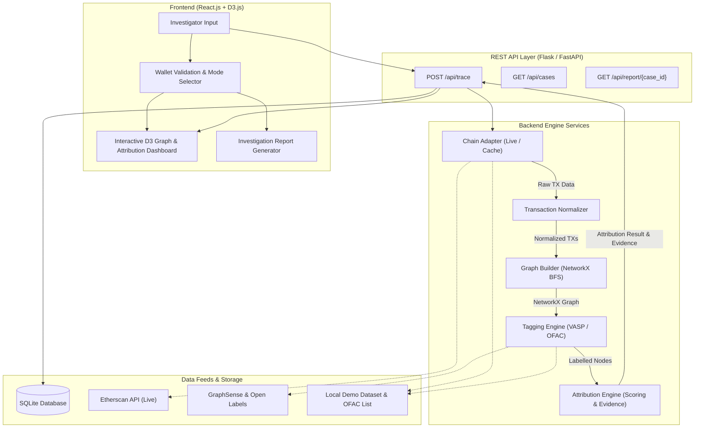

# 🔍 CryptoTrace

### Automated Attribution of Unknown Cryptocurrency Wallets to Nearest Virtual Asset Service Providers (VASPs)

> **Smart India Hackathon 2026 — Problem Statement PS-182**

CryptoTrace is a specialized blockchain intelligence prototype designed for AML compliance officers and law enforcement investigators to attribute unknown cryptocurrency wallets to their **nearest likely Virtual Asset Service Provider (VASP)** using multi-hop transaction graph analysis, explainable scoring heuristics, and open intelligence feeds.

---

## 📌 Problem & Objective

Raw blockchain transactions reveal wallet addresses and movement of funds, but rarely indicate which exchange or service controls an address.

- **Primary Goal**: Accept an unknown Ethereum wallet address, traverse 2–3 hops of transaction history, identify connected labelled VASP entities, rank candidate VASPs with an explainable confidence score, and generate an investigation report.
- **Service-Level Focus**: CryptoTrace performs **service/VASP-level attribution** (e.g., Binance, Coinbase). It does **not** attempt personal de-anonymization or claim legally definitive forensic evidence.

---

## ⚡ Core Features

- **Multi-Hop Traversal (2–3 Hops)**: BFS graph traversal starting from an unknown target wallet.
- **Explainable Attribution Engine**: Ranks candidate VASPs using graph proximity, path multiplicity, transaction recency, and label reliability.
- **Dual Execution Modes**:
  - 🛠 **DEMO MODE**: Uses verified, cached local datasets ensuring 100% offline reliability during SIH presentations.
  - 🌐 **LIVE MODE**: Queries live Etherscan and open intelligence APIs.
- **Risk & OFAC Flagging**: Surfacing known sanctioned addresses and high-risk entities along transaction paths.
- **Interactive D3 Transaction Graph**: Dynamic visual exploration of nodes, edges, hop levels, and highlighted attribution paths.
- **Investigation Report Generation**: Exportable case summary detailing VASP candidates, confidence level, evidence trail, and risk breakdown.

---

## 🏗 System Architecture



---

## 🔍 Attribution Methodology & Scoring

CryptoTrace uses deterministic, explainable graph heuristics rather than black-box models:

1. **Direct Match**: If target wallet itself is a known VASP → Direct Attribution (Highest Confidence).
2. **BFS Traversal**: Traverse outward up to 3 hops to locate labelled VASP nodes.
3. **Proximity Weight**: 1 Hop > 2 Hops > 3 Hops.
4. **Path Support**: Multiple independent transaction paths reinforce candidate confidence.
5. **No Forced Attribution**: If evidence is below threshold, returns `"No Confident Attribution"` to avoid false positives.

```
Confidence Score = Graph Proximity + Path Multiplicity + Recency + Label Reliability
```

---

## 🛠 Tech Stack

- **Frontend**: React.js, D3.js, Axios, CSS Modules / Tailwind
- **Backend**: Python 3.10+, Flask / FastAPI
- **Graph Engine**: NetworkX
- **Database**: SQLite
- **APIs & Data**: Etherscan API, GraphSense / Open Labels, OFAC Sanctions List

---

## 📁 Repository Structure

```
CryptoTrace/
├── backend/
│   ├── app.py                # Main API Server Entrypoint
│   ├── routes/               # API Endpoints (trace, cases, report, health)
│   ├── services/             # Chain Adapter, Graph Engine, Attribution, Risk
│   ├── data/                 # Demo Cases, Labels & OFAC JSON files
│   └── database/             # SQLite DB setup
├── frontend/
│   ├── src/
│   │   ├── components/       # WalletInput, AttributionCard, EvidencePanel
│   │   ├── pages/            # Dashboard, Investigation, Report
│   │   └── graph/            # TransactionGraph (D3.js)
│   └── package.json
├── docs/                     # Architecture & Demo documentation
├── README.md
└── requirements.txt
```

---

## 📡 API Specification

### `POST /api/trace`
**Request**:
```json
{
  "chain": "ethereum",
  "address": "0x742d35Cc6634C0532925a3b844Bc454e4438f44e",
  "max_hops": 3,
  "mode": "demo"
}
```
**Response**:
```json
{
  "case_id": "CASE-001",
  "input_address": "0x742d35...",
  "selected_vasp": "Binance",
  "confidence": 87,
  "hop_distance": 2,
  "path": ["0x742d35...", "0xHop1Address...", "0xBinanceVASP..."],
  "evidence": [
    "Target wallet directly transacted with 1-hop intermediary",
    "2-hop relationship to verified Binance hot wallet",
    "3 independent transaction paths support connection"
  ],
  "risk_flags": [],
  "nodes": [...],
  "edges": [...]
}
```

---

## 🚀 Quick Start & Setup

### Prerequisites
- Python 3.10+
- Node.js 18+

### 1. Backend Setup
```bash
cd backend
python -m venv venv
# On Windows:
.\venv\Scripts\activate
pip install -r requirements.txt
python app.py
```
*Backend runs on `http://localhost:5000`*

### 2. Frontend Setup
```bash
cd frontend
npm install
npm start
```
*Frontend runs on `http://localhost:3000`*

---

## 🎯 Ground Truth Demo Cases

1. **Case 1 (Successful Attribution)**: 2-hop trace resolving to a known VASP (e.g. Binance) with 85%+ confidence.
2. **Case 2 (Sanctions / Risk Flag)**: Wallet connected to an OFAC-flagged or mixer-associated address.
3. **Case 3 (No Confident Attribution)**: Isolated target wallet with no path to a known VASP within 3 hops.

---

## ⚖️ Scope & Disclaimer

- **Hackathon Scope**: Ethereum prototype supporting up to 3-hop traversal. Multi-chain support, ML/GNN attribution, and real-time monitoring are planned for future roadmap releases.
- **Disclaimer**: CryptoTrace provides heuristic decision assistance for AML research and is **not** legally binding or court-admissible forensic evidence.
