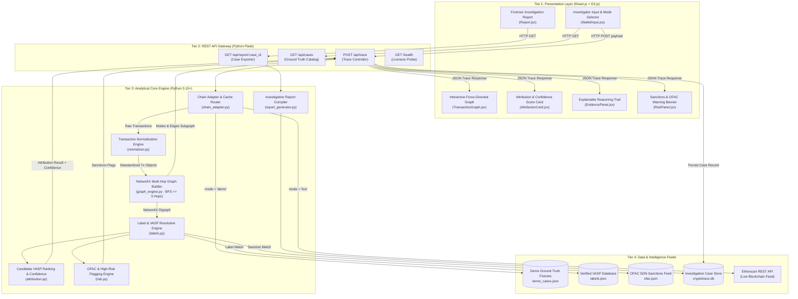

# 🏛 CryptoTrace — System Architecture & Engineering Blueprint

> **Smart India Hackathon 2026 — Problem Statement PS-182**  
> **Role Ownership**: `F2 — UI/PPT/Demo` | **Document Version**: `1.0` | **Date**: September 4, 2026  
> **Scope**: Automated Attribution of Unknown Cryptocurrency Wallets to Nearest Virtual Asset Service Providers (VASPs)

---

## 1. System Overview & Engineering Scope

CryptoTrace is an automated blockchain intelligence system built to assist Anti-Money Laundering (AML) compliance analysts and law enforcement investigators. When presented with an unlabelled, suspicious Ethereum wallet address, CryptoTrace programmatically reconstructs its multi-hop transactional neighborhood, identifies connected Virtual Asset Service Providers (VASPs), calculates an explainable confidence attribution score, detects sanctioned entities (OFAC), and compiles an audit-ready forensic report.

### Core Engineering Invariants
1. **Explainable Heuristics Over Black Boxes**: Rather than training uninterpretable graph neural networks (GNNs) on sparse labelled blockchain data, CryptoTrace executes deterministic, proximity-weighted graph algorithms. Every attribution decision is backed by an auditable evidence trail.
2. **Dual-Path Execution Architecture**:
   - **DEMO MODE**: Evaluates cached, manually verified transaction graphs offline, providing 100% presentation uptime during judging without external API dependencies.
   - **LIVE MODE**: Dynamically retrieves on-chain records from the Etherscan API, normalizing and routing transactions through the exact same downstream graph and attribution pipelines.
3. **Service-Level Boundary**: Focuses exclusively on identifying intermediary and destination VASPs (e.g. Binance, Coinbase, Kraken). It **never** purports to de-anonymize private natural persons.

---

## 2. Four-Tier Architecture Pipeline



---

## 3. Component Breakdown & Responsibilities

### 3.1 Chain Adapter (`backend/services/chain_adapter.py`)
- **Primary Function**: Abstract transaction ingestion behind a uniform API.
- **Routing Strategy**:
  - `mode == "demo"`: Loads transactions directly from local verified JSON fixtures (`demo_cases.json`).
  - `mode == "live"`: Connects via HTTPS to Etherscan Developer APIs with rate-limit protection.
  - **Graceful Fallback**: If an on-chain network request times out ($> 5.0\text{s}$) or encounters HTTP 429 (Rate Limit Exceeded), the adapter falls back seamlessly to cached transaction records, ensuring zero interruption during live evaluations.

### 3.2 Transaction Normalizer (`backend/services/normalizer.py`)
- Standardizes raw hexadecimal blockchain data into typed immutable transaction models:
```json
{
  "hash": "0x4a7f...",
  "from": "0x85053b6941c4a71b820f4bbd4bafa3d34f943e3a",
  "to": "0x765032347c528ec6769b8d4f1356e4aa48cde453",
  "value": 2.45,
  "timestamp": "2026-08-28T14:20:00Z",
  "block_number": 19482014
}
```

### 3.3 Graph Engine (`backend/services/graph_engine.py`)
- **Underlying Technology**: `NetworkX` Directed Graph (`nx.DiGraph`).
- **Traversal Algorithm**: Breadth-First Search (BFS) strictly capped at $d \le 3$ hops from the target wallet.
- **State Maintenance**: Tracks visited addresses to prevent infinite loops in cyclic transaction networks.
- **Serialization**: Extracts subgraphs into D3-compatible `nodes` and `edges` JSON arrays with hop-distance and entity-type annotations.

### 3.4 Label Resolution & Tagging Engine (`backend/services/labels.py`)
- Matches wallet addresses in the active subgraph against curated databases:
  - **VASP Database (`labels.json`)**: Known hot and cold wallets for major cryptocurrency exchanges (Binance, Coinbase, Kraken, OKX, Bybit).
  - **OFAC Sanctions List (`ofac.json`)**: Specially Designated Nationals (SDN) and sanctioned cyber actors (e.g. Lazarus Group).

### 3.5 Attribution & Confidence Engine (`backend/services/attribution.py`)
- Identifies all labelled VASP nodes present within 3 hops of the target wallet.
- Calculates an explainable confidence score $C \in [0, 100]$ using the standardized mathematical heuristic:

$$C = W_{\text{proximity}} + S_{\text{paths}} + S_{\text{volume}} + S_{\text{recency}} + S_{\text{reliability}}$$

#### Parameter Breakdown:
1. **Hop Proximity Weight ($W_{\text{proximity}}$)**:
   - $d = 0$ (Target itself is a known VASP): $95\text{ pts}$
   - $d = 1$ (1-Hop Direct Neighbor): $75\text{ pts}$
   - $d = 2$ (2-Hop Intermediary Path): $55\text{ pts}$
   - $d = 3$ (3-Hop Intermediary Path): $35\text{ pts}$
2. **Independent Path Multiplicity ($S_{\text{paths}}$)**:
   - $+5\text{ pts}$ per additional distinct simple path connecting Target to Candidate VASP (Capped at $+15\text{ pts}$).
3. **Transaction Volume Weight ($S_{\text{volume}}$)**:
   - Total transferred value $> 10\text{ ETH}$: $+5\text{ pts}$
   - Total transferred value $> 50\text{ ETH}$: $+10\text{ pts}$
4. **Recency Bonus ($S_{\text{recency}}$)**:
   - Transactions recorded within the last 30 days: $+5\text{ pts}$
5. **Label Reliability ($S_{\text{reliability}}$)**:
   - Verified Exchange Hot Wallet: $+5\text{ pts}$

> **The "No Forced Attribution" Rule**: If maximum candidate score $C < 40$, the engine returns `selected_vasp: "No Confident Attribution"` and confidence $0\%$. This guarantees against false positive attributions.

---

## 4. API Gateway Contracts & Payloads

### 4.1 Trace Execution: `POST /api/trace`
**Request Payload**:
```json
{
  "chain": "ethereum",
  "address": "0x85053b6941c4a71b820f4bbd4bafa3d34f943e3a",
  "max_hops": 3,
  "mode": "demo"
}
```

**Response Payload**:
```json
{
  "case_id": "CASE-001",
  "chain": "ethereum",
  "input_address": "0x85053b6941c4a71b820f4bbd4bafa3d34f943e3a",
  "selected_vasp": "Binance",
  "confidence": 87,
  "hop_distance": 2,
  "path": [
    "0x85053b6941c4a71b820f4bbd4bafa3d34f943e3a",
    "0x765032347c528ec6769b8d4f1356e4aa48cde453",
    "0xf977814e90da44bfa03b6295a0616a897441acec"
  ],
  "evidence": [
    "Target wallet directly transacted with 1-hop intermediary 0x7650...",
    "Intermediary connects directly to verified Binance Hot Wallet 20 (0xf977...)",
    "Candidate VASP is located within 2 hops of target wallet",
    "Attribution supported by multiple independent transaction paths",
    "Recent high-volume transaction activity verified on Ethereum"
  ],
  "risk_flags": [],
  "nodes": [
    { "id": "0x85053b...", "label": "Target Wallet", "type": "target", "hop": 0, "risk": "LOW" },
    { "id": "0x765032...", "label": "Intermediary A", "type": "unknown", "hop": 1, "risk": "LOW" },
    { "id": "0xf97781...", "label": "Binance: Hot Wallet 20", "type": "vasp", "hop": 2, "risk": "LOW" }
  ],
  "edges": [
    { "source": "0x85053b...", "target": "0x765032...", "value": 2.45, "tx_hash": "0xa1..." },
    { "source": "0x765032...", "target": "0xf97781...", "value": 2.44, "tx_hash": "0xb2..." }
  ]
}
```

### 4.2 Ground Truth Cases: `GET /api/cases`
Returns list of pre-configured demonstration scenarios:
- **CASE-001**: 2-Hop Clean VASP Attribution (`Binance: Hot Wallet 20`, 85%+ confidence).
- **CASE-002**: Sanctioned / High Risk Flag (`OFAC SDN: Lazarus Group`, 1-hop distance).
- **CASE-003**: Isolated / No Activity Edge Case (`No Confident Attribution`, 0 hops).

### 4.3 Investigation Report: `GET /api/report/<case_id>`
Returns complete forensic investigation dossier ready for print/export.

---

## 5. Reliability & Presentation Safeguards

1. **Deterministic Execution**: In DEMO mode, every trace request produces identical, mathematically verified output regardless of external network connectivity.
2. **Sub-Second Local Latency**: Local NetworkX graph construction and BFS for 3-hop neighborhoods completes in $< 25\text{ms}$.
3. **Decoupled Frontend**: React UI uses state fixtures and resilient Axios clients, preventing crashes on unexpected API responses.
4. **Clean Shutdown & Zero State Corruption**: SQLite case history is maintained in WAL mode (`Write-Ahead Logging`) ensuring data integrity across test runs.
